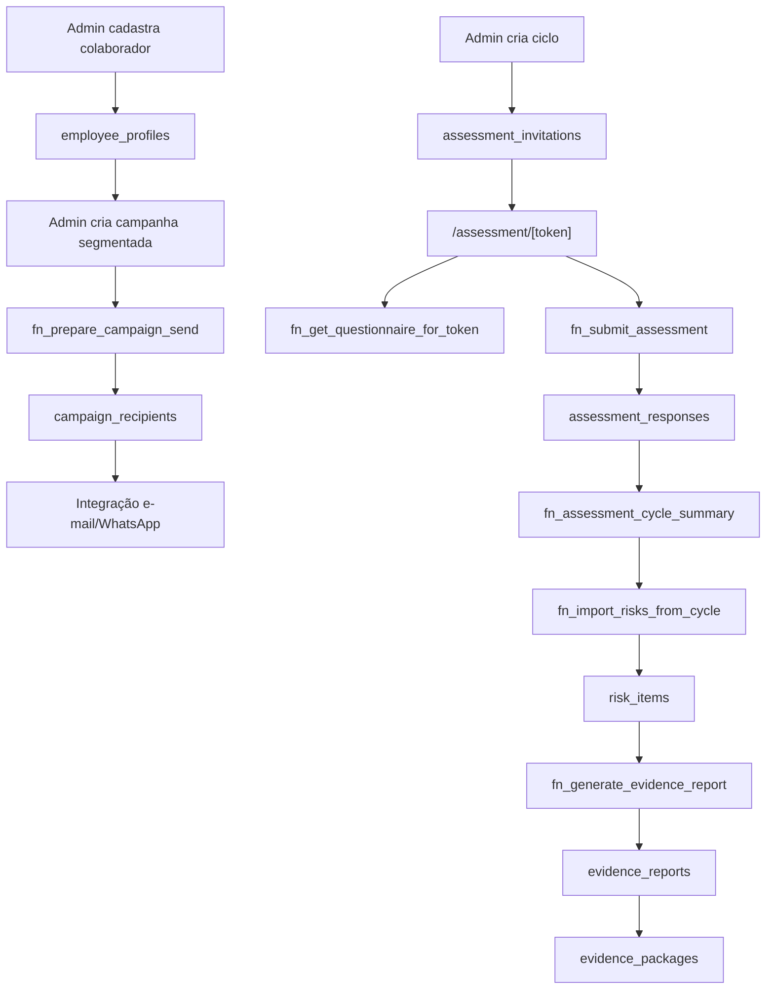

# Reconciliação e implementação proposta

Este documento descreve o estado da branch `agent/reconciliacao-supabase-fixes`.
Os SQLs foram preparados, mas não executados. O banco, os seeds, o deploy e
`main` não foram alterados.

## 1. Reclassificação dos achados

| Achado | Classificação | Resultado |
|---|---|---|
| Relatório de evidência usa colunas inexistentes | Confirmado, crítico operacional | `FIX-001` proposto e chamada TypeScript corrigida |
| `reverse_scored` ignorado | Elevado para alto | `FIX-003` proposto nas agregações e importação |
| Formulário de risco incompatível com enums reais | Confirmado | Campos, filtros e labels alinhados |
| Criação de pacote sem período obrigatório | Confirmado | Formulário e action corrigidos |
| Token de avaliação em texto puro | Confirmado, crítico de privacidade | `PRIV-001` migra legado e grava novos tokens somente como hash |
| Resposta vinculada ao convite | Confirmado, crítico de privacidade | `PRIV-001` cria lotes anônimos e remove o vínculo nas novas respostas |
| Participação por grupo abaixo do limiar | Confirmado, médio | `PRIV-001` suprime contagens e taxas de grupos pequenos |
| Dados volumosos seriam reais | Descartado pela evidência disponível | Padrão sintético confirmado; nenhuma exclusão realizada |
| `tenant_subscriptions` vazio impede o produto | Confirmado, operacional | `check_plan_limit` e precificação saíram da jornada; nenhuma assinatura fictícia foi criada |
| Ciclos não encerram em `ends_at` | Confirmado, operacional | Função service-only, rota autenticada e agendamento Vercel propostos |
| Ausência isolada de `auth.getUser()` seria crítica | Rebaixado | Risco depende de RLS, role, tenant e campos mutáveis |

## 2. Call graph crítico

## 3. Matriz corrigida de permissões

| Objeto | PUBLIC | anon | authenticated | service_role | Regra proposta |
|---|---:|---:|---:|---:|---|
| `fn_submit_assessment(text,text)` | não | executar | não | não | Jornada pública por token |
| `fn_get_questionnaire_for_token(text)` | não | executar | não | não | Jornada pública por token |
| `fn_generate_evidence_report(...)` | não | não | executar | executar | Função valida owner/admin |
| `fn_assessment_cycle_summary(uuid)` | não | não | executar | executar | Função valida membership |
| `fn_assessment_group_results(...)` | não | não | executar | executar | Função valida tenant/grupo |
| `fn_import_risks_from_cycle(uuid)` | não | não | executar | executar | Função valida role/tenant |
| `questionnaire_sections/items` | não | sem SELECT | via RLS/RPC | conforme backend | Público usa gateway |
| `subscription_plans` | não | sem SELECT | sem SELECT | conforme backend | Sem precificação |

## 4. Plano de migrations

| Identificador | Arquivo | Situação |
|---|---|---|
| `SEC-001` | já coberto por `20260727100000_sec_block1_expand.sql` | Não duplicado |
| `SEC-002` | `20260728154500_sec_002_retire_plan_limit.sql` | Proposto |
| `SEC-003` | já coberto pelas migrations SEC-BLOCK1 | Não duplicado |
| `SEC-004` | já coberto pelas migrations SEC-BLOCK1 | Não duplicado |
| `SEC-005` | `supabase/manual/sec_005_default_function_privileges_dashboard.sql` | Manual via Dashboard SQL Editor; fora do fluxo automático |
| `SEC-006` | `20260728153000_sec_006_table_privileges.sql` | Proposto |
| `FIX-001` | `20260728150000_fix_001_evidence_reports.sql` | Proposto |
| `FIX-002` | segmentação já corrigida em SEC-BLOCK1; UI completada | Não duplicado |
| `FIX-003` | `20260728151000_fix_003_reverse_scoring.sql` | Proposto |
| `FIX-004` | `20260728152000_fix_004_assessment_submission.sql` | Proposto |
| `PRIV-001` | `20260728152500_priv_001_anonymous_assessments.sql` | Proposto |
| `FIX-005` | `20260728155000_fix_005_close_expired_cycles.sql` | Proposto |
| `DATA-001` | `data001_seed_inventory_readonly.sql` | Somente leitura |

## 5. SQL completo proposto

Cada SQL está no diretório `supabase/migrations` e possui rollback correspondente
em `supabase/rollbacks`. Os arquivos contêm assinatura integral, dependências,
estado anterior/posterior, testes e consultas de verificação.

Nenhum SQL de exclusão foi criado. O inventário `DATA-001` contém apenas `SELECT`.

## 6. Correções TypeScript

| Arquivo ou módulo | Correção |
|---|---|
| `components/auth/password-input.tsx` | Alternância mostrar/ocultar senha acessível |
| `lib/schemas/risk.ts` e telas de riscos | Enums, prioridade e datas alinhados ao catálogo |
| `lib/evidence/actions.ts` | Assinatura RPC completa e validação |
| `components/evidence/*` | Geração de relatório e criação de pacote |
| `dashboard/reports` | Campos e statuses reais |
| `dashboard/employees` | Cadastro de destinatário com e-mail/telefone |
| `campaign-create-form.tsx` | Segmentação por estabelecimento/departamento |
| `campaigns/actions.ts` | Normalização do FormData, auth, role e allowlist |
| `lib/assessments/actions.ts` | Convites por e-mail/WhatsApp com token forte, hash e idempotência |
| detalhe do ciclo | Envio de convites e estatísticas protegidas pelo limiar |
| `api/cron/close-assessment-cycles` | Encerramento server-only protegido por `CRON_SECRET` |
| navegação/layout | “Colaboradores” adicionado; assinatura, preços e alertas removidos |

## 7. Matriz de testes

| Cenário | Resultado esperado |
|---|---|
| Anônimo envia avaliação com token válido | Aceito uma única vez |
| Token inválido, expirado ou repetido | Resposta genérica e nenhuma escrita |
| Item estranho, duplicado ou campo inválido | Rejeitado |
| Viewer cadastra colaborador | Negado |
| Owner/admin cadastra colaborador do tenant | Aceito |
| Usuário do tenant A referencia unidade do tenant B | Negado |
| Campanha sem contatos compatíveis | Preparação informa zero destinatários |
| Item normal e reverso semanticamente equivalentes | Mesma direção de risco |
| Grupo abaixo do limiar | Médias não expostas |
| Participação de grupo abaixo do limiar | Contagens e taxa não expostas |
| Evidência de ciclo | Usa `starts_at`/`ends_at` e contagens calculadas |
| Denúncia por período | Contagens independentes, sem multiplicação |
| Webhook sem assinatura, inválido ou repetido | Falha fechada/idempotente |
| Jornadas públicas de denúncia | Permanecem acessíveis pelo gateway v2 |

## 8. Riscos de regressão

- A escala reversa proposta assume o instrumento atual de 1 a 5. Outro
  instrumento deve declarar limites antes de reutilizar a fórmula.
- A revogação de SELECT deve ser testada junto das cinco jornadas públicas.
- A policy de `employee_profiles` admite cadastro apenas por owner/admin.
- A migração de default privileges de `supabase_admin` exige uma role autorizada.
- Relatórios já gerados com lógica antiga não são recalculados automaticamente.
- Riscos importados anteriormente podem refletir pontuação invertida incorreta.
- A compatibilidade mantém tokens legados em texto até a limpeza controlada.
- O agendamento exige `CRON_SECRET` no deploy e a migration `FIX-005` aplicada.

## 9. Pontos ainda dependentes do ambiente

1. Aplicar e testar as migrations primeiro em staging/branch descartável, com
   backup e restauração comprovada.
2. Configurar `CRON_SECRET`, URL pública e provedores reais no preview.
3. Definir se riscos e relatórios sintéticos antigos serão removidos ou apenas
   marcados antes de validar a nova lógica.
4. Executar `SEC-005` com autoridade sobre `supabase_admin`.
5. Inventariar e remover apenas os registros sintéticos exatos, preservando as
   duas contas do proprietário e sem usar critério amplo por data.

## 10. Validação local

- TypeScript: aprovado.
- Build de produção: aprovado.
- ESLint: zero erros; avisos preexistentes.
- Guardas P0: 7 aprovadas.
- Guardas da reconciliação: 10 aprovadas.
- Call graph de segurança: 25 aprovados.
- Gateway público: 50 aprovados.
- Canais fail-closed: 58 aprovados.
- Migrations: revisão estática aprovada; execução bloqueada por ausência de
  PostgreSQL/Supabase descartável neste ambiente.
